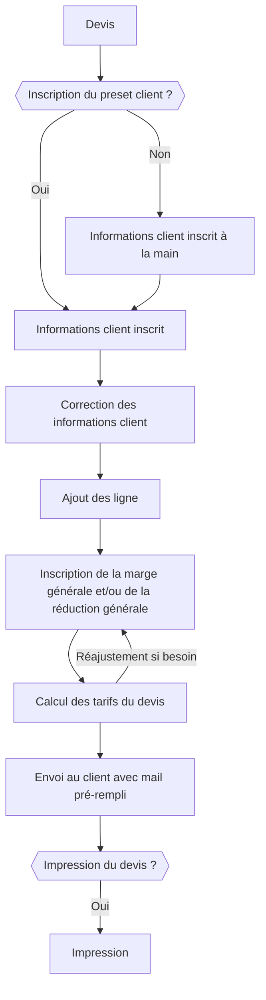
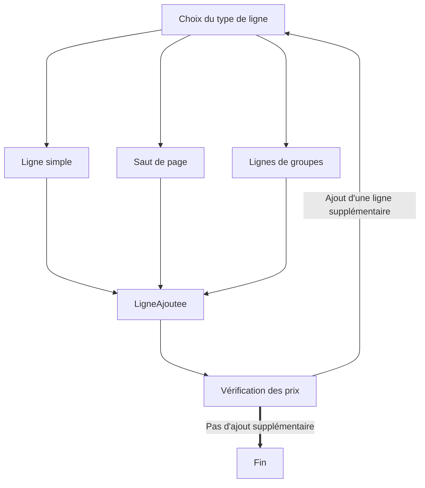

**Description complète du projet**

## Sommaire

- Lexique
- Description générale de l'outil

## Lexique

- pré-fait : cela veut dire que les champs sont rempli par l'utilisateur au préalable à sa façon avec la possibilité de choisir quoi et ou est disposé des informations en lien avec le client (par exemple dans les mail, l'utilisateur va choisir où le nom de l'entreprise est citée, où son numéro est écrit, etc...)
- Automatiquement rempli : L'ensemble des champs avec des détails variables d'un objet pré-fait sont rempli en fonction du client/contact choisi.
- preset : objet pré-enregistré avec des champs pré-rempli, cela fait référence à pré-fait mais avec une dimension plus grande avec plus de champs.
- Tout ce qui est **<u>en gras souligné</u>** est une chose à préciser avec les discussions client.
- Utilisateur : La personne utilisant le logiciel (l'utilisateur est aussi le client du projet, dans ce document, le client fait référence à autre chose)
- Client : Le client de l'utilisateur

**<u>Partie à valider</u>**

## Description générale

L'outil attendu est un CRM amélioré - Customer Relationship Management ou Gestion de relation client. Cet outil possède davantage de fonctionnalités que un CRM classique ainsi que des fonctionnalités en moins pour pouvoir se conformer aux besoin d'une micro-entreprise. (1 compte = 1 entreprise, pas de gestion de comptes et d'accès au sein d'une entreprise)

Cet outil doit répondre à plusieurs critères :

- Gestion des prix fournisseurs
- Gestion des devis avec prise en compte de preset, des prix fournisseur ainsi que des marges.
- Gestion de la relation client
- Gestion du chiffre d'affaire
- Gestion des factures
- **<u>Voir si il reste des choses à ajouter</u>**

**<u>Partie à valider</u>**

## Fonctionnalités

**Fonctionnalités générales**

- Un bouton d'appel support dev

- Un bouton de déconnection

- Un bouton d'aide pour avoir accès à la documentation

- Une barre d'outils pour accéder à l'ensemble des fonctionnalités du logiciel

- Une bulle pour les discussions en cours

  

**Fonctionnalités du tableau de bord**

- Disposition du chiffre d'affaire actuel et graphique supplémentaires pour afficher la progression du chiffre d'affaire
- Des statistiques sur ses dépenses et achat à la façon d'un graphique en cascade

**<u>Partie à valider</u>**

**Description d'un dossier**

- Informations du client

- Devis en lien avec le dossier

- L'état du dossier 

  - Brouillon
  - devis en attente
  - devis accepté
  - commande en cours de réalisation
  - commande réalisée
  - Commande payée
  - Commande annulée
  - D'autres états peuvent être ajoutés, ce ne sont que des exemples.
    Un dossier n'a qu'un état à la fois, et n'est pas sensé revenir en arrière.
    **<u>Voir si la liste des état est bonne</u>**
  
- L'historique des états avec les dates

- Liste d'étiquettes

  - Ces étiquettes peuvent être pour détailler l'état du dossier ou donner des précisions.
    Une étiquette peut être par exemple "Payé" si une commande est payée mais qu'elle n'est pas encore fini d'être réalisée..

**<u>Partie à valider</u>**

**Fonctionnalités du système de gestion des dossiers**

- Tableau interactif possédant des dossiers
  - Les colonnes correspondent aux états des dossiers
  - Dans chaque colonnes, un dossier se représente sous forme d'une case cliquable
    - Si on clique cela permet d'ouvrir la description du dossier pour le modifier ou le consulter
  - Chaque dossier peut être glissé d'une colonne à une autre
  - Cela sera dans un style de Github ou Trello
- Un bouton pour relancer les clients n'ayant pas payé
- Pouvoir sélectionner la liste des dossier pour relancer ces dossiers là et non les autres
- Point important à mettre sur l'ergonomie

**<u>Partie à valider</u>**

**Fonctionnalité sur la création de devis**

- Preset des informations clients
- Modifier les informations clients après le preset 
  Ou ajouter les informations à la main si le client n'existe pas
- Preset de groupe de ligne
  - Une ligne étant un produit ou un service
    Un preset de groupe de ligne permet d'ajouter plusieurs lignes à la fois avec marges et/ou réductions
- Ajouter à la main des lignes ou saut de page pour séparer groupes de produit/service
- Remplissage automatique des informations de l'utilisateur

**Informations d'une ligne d'un devis**

- Référence du produit (référence que l'utilisateur à donné et non la référence fournisseur)
- Description du produit/service ainsi qu'une description pour sa pause ou la méthode utilisé
- Prix unitaire fournisseur
- Nombre de produit/service
- Marge individuelle par produit
  - **<u>Question sur les marges : si on met une marge sur l'ensemble du devis, cela retire les marges individuelles ou pas ?</u>**
- Réduction individuelle par produit 
  - possible d'ajouter une réduction supplémentaire pour l'ensemble du devis dans la fin du processus de création du devis

## Annexe

**Création de devis**

1. Schéma de création d'un devis :

 
 

2. Schéma d'ajout de ligne :

Brouillon

**En ce qui concerne la création des devis : **

- Il existe aussi des preset pour ajouter des groupes de produits ou services sans les ajouter à la main
- Auto remplissage des emplacement en lien avec le client
- <u>En ce qui concerne la création d'un devis : voici le schéma type :</u>
  - Inscription du nom du client
    - Cela propose une auto complétion des champs si le client appartient à la base de donnée
      - ces champs sont : 
        - Adresse d'un contact des contact du client
        - Adresse de facturation
        - Pays du client
        - Taxes en lien avec le pays en question
        - plusieurs autres champs dont je ne me souvient pas
  - Ajout des informations supplémentaires si besoin (tout type d'information)
  - Ecriture du texte du devis (Preset possible)
  - Ajout d'une ligne (l'un des choix)
    - Ajout des différent produit/service
      - Chaque produit à une référence de produit pour l'interne de la boite
      - Description du produit/service ainsi qu'une description pour sa pause ou la méthode utilisé
      - Prix unitaire Hors taxe
      - Nombre de produit/service
      - Marge individuelle par produit (possible de la supprimer pour mettre une marge sur l'ensemble du devis)
      - Réduction individuelle par produit (possible de le supprimer pour retirer la marge ou de faire une marge sur l'ensemble du devis)
    - Ajout de groupe 
      - Ajout d'un preset de plusieurs lignes de produits avec les marges, références, descriptions, réductions, nombre ect
    - Un saut de page pour séparer si il y a besoin d'une page par produit ou une page par type de produit ou autre....
  - Ajout ou non de réductions ou marges de l'ensemble du devis
  - Envoi par mail du devis à un ou plusieurs contact pour le client
    - Le message de mail doit être pré-enregistré et doit pouvoir être automatiquement rempli dépendant du client et du service rendu.
    - Le mail doit pouvoir être modifiable si besoin (si il y a des erreurs ou des précision à faire)
- Le devis est automatiquement transmis dans un dossier nouvellement créé avec numéro de dossier et état par défaut : brouillon (envoyé si le mail à été envoyé)
  Le devis est directement visible dans le CRM.
- Il y a la possibilité de relancer les clients automatiquement ou manuellement par des mail pré-fait et automatiquement rempli 

En ce qui concerne l'ensemble des marges et tarifications des produits, cela permet de prévoir les pertes et la marge totale à la fin du devis, donc cela est très important.

Le client doit pouvoir avoir un chat de discussion avec un utilisateur du logiciel afin de corriger/discuter ou négocier avec des choses en lien avec le devis.

Lorsqu'un devis est accepté il passe en Commande, ce qui ne change pas grand chose pour le logiciel. (en apparent)
Dans le CRM, l'utilisateur doit pouvoir suivre les commandes et leurs états.

**Chose voulu par l'utilisateur :**

- Possibilité d'avoir un contact rapide avec le support pour des demandes avec les devs
- Si un dossier est en état de commande alors l'utilisateur peut commander soit :
  - L'ensemble des produits d'un coup directement à ses fournisseur
  - Sélectionner les lignes avec seulement les produits qui intéressent (parce que les autres seraient en stock)
  - Commander les produits qui manque directement via un bouton
- Possibilité de gérer automatiquement les prix des produits fournisseur afin d'actualiser ces derniers pour ne pas à actualiser manuellement le prix fournisseur des près de 1 000 produits
  - Pour gérer les prix, cela va garder la marge que l'utilisateur aura fixé et ainsi calculer le prix avec marge automatiquement
  - le prix unitaire HT fournisseur, la marge et le prix avec la marge doivent être visibles
- Avoir la possibilité de relancer automatiquement les clients qui ne paient pas après un certain temps ou aussi avoir la possibilité d'avoir un bouton pour relancer tout les clients 
  - Les relances se font par mail avec les des mail auto-rempli dépendant du contact et du client
- Avoir la possibilité de générer des textes automatiques pour l'envoi de goodies, lettres de remerciement ou autres (à tout les clients ou que à certaines étant sélectionnés)
- Avoir la possibilité d'exporter les données de l'ensemble des articles sous forma excel.
  - Ainsi que d'avoir l'ensemble des données de ces articles dans ce excel (référence que l'utilisateur à donné, description, référence fournisseur, date de mise à jour, prix, marge, prix après marge, données supplémentaires )
- La possibilité de lier les comptes bancaires de la boite pour pouvoir suivre son solde
- **Système de lecture de facture**
- L'ensemble du logiciel doit pouvoir être accessible depuis une page web par ordinateur, téléphone portable ou tablette.
- Le logiciel doit être liable à DropBox afin de générer une base de donnée de secours en cas de problème avec des données régulièrement mis à jours (tous les jours, pas trop souvent non plus afin de ne pas saturer le réseau ect)
- Le logiciel doit pouvoir être liable à d'autres logiciel (à la façon de twitch pouvant être liable à steam ou autre...)
- Le logiciel doit pouvoir prendre en compte les frais de déplacement 
  - Soit pour se rembourser soi si les trajets sont à frais de l'entreprise
  - Soit pour demander un remboursement au client afin de rembourser les frais de trajets

**Lecture de facture**

L'utilisateur veut un système permettant de lier un client à un preset de facture, ainsi, en scannant la facture et en liant le client, le logiciel va automatiquement détecter les champs et les enregistrer dans la base de donnée pour pouvoir les comptabiliser dans le logiciel et les envoyer au comptable qui va permettre de faire son travail plus simplement.

Le système sera en deux parties, la partie enregistrement d'un preset et partie lecture d'une facture :

​	<u>Partie enregistrement</u>

L'enregistrement se suivra le schéma suivant :

- Choix du client
- Scan de la facture
- Pour tout les champs
  - Choix du champ
  - Définition de la zone à "regarder"
  - Définition du forma si cela en à besoin (notament les dates et les prix)
- Vérification que sur la facture scanée les données sont bien enregistré

Le preset de facture sera donc compté comme nouveau pour un nombre d'utilisation déterminée par l'utilisateur

​	<u>Partie lecture de facture</u>

La lecture d'un preset "nouveau" suivra le schéma suivant :

- Ajout de facture
- Scan de la facture
- Choix du client (choix du preset si le client possède plusieurs types de factures différentes)
- Vérification que les champs sont bien enregistrés
- Correction des champs si besoin
- Si de grosses erreurs sont présentes, enregistrer la facture comme "lecture défaillante" afin qu'un développeur puisse vérifier le problème avec l'utilisateur
- Enregistrement de la facture dans la base de donnée avec toutes les données

Durant le processus de la lecture, les données doivent être enregistrés sur un fichier temporaire, afin de prévoir les crash ou déconnections qui pourraient faire perdre la progression

