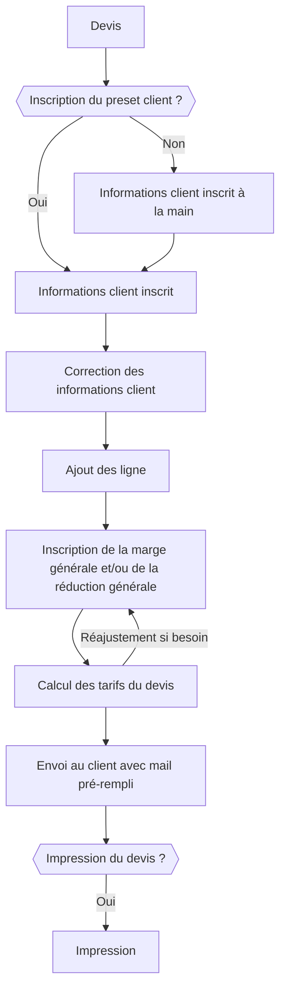
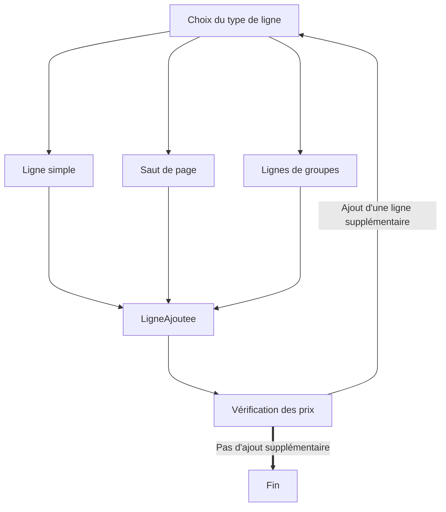
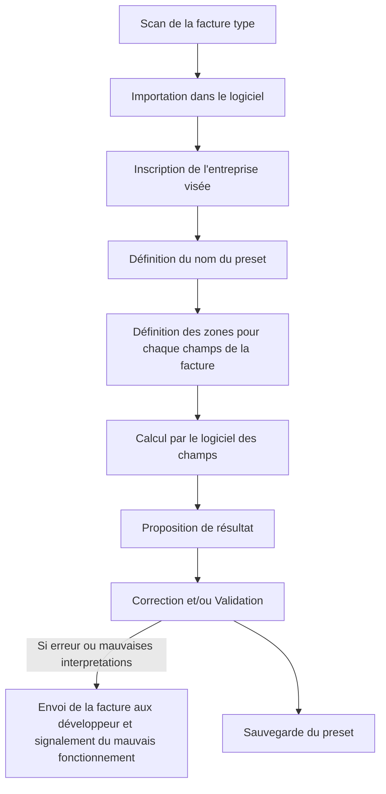
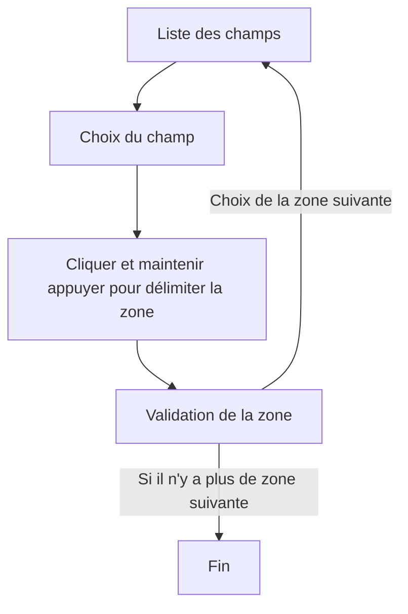
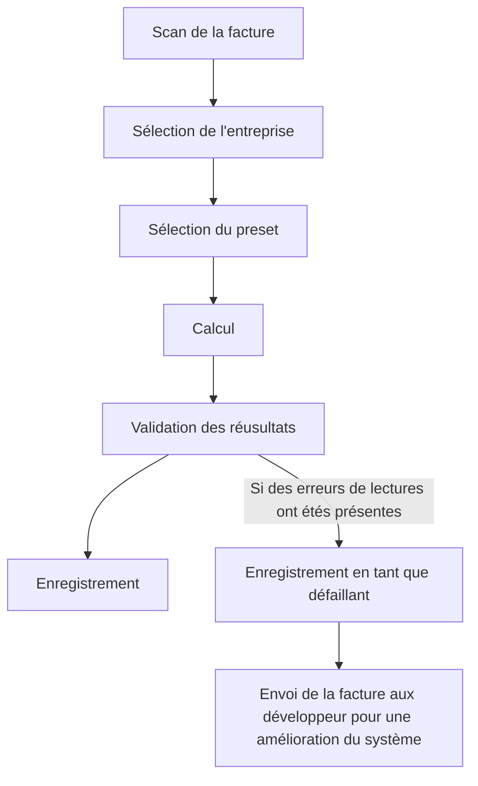
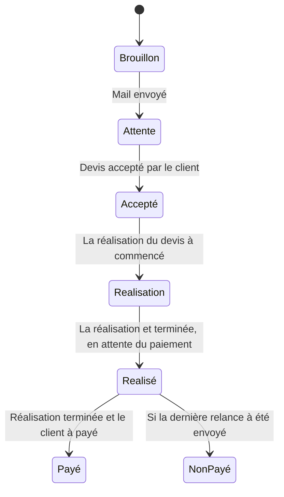
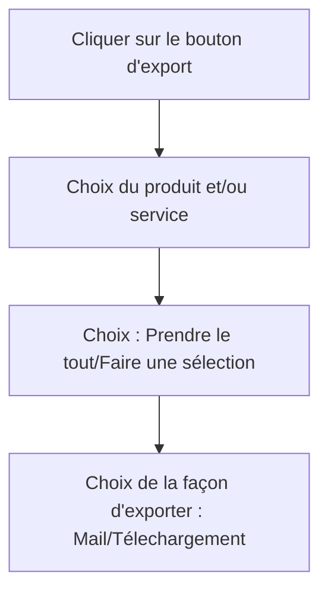
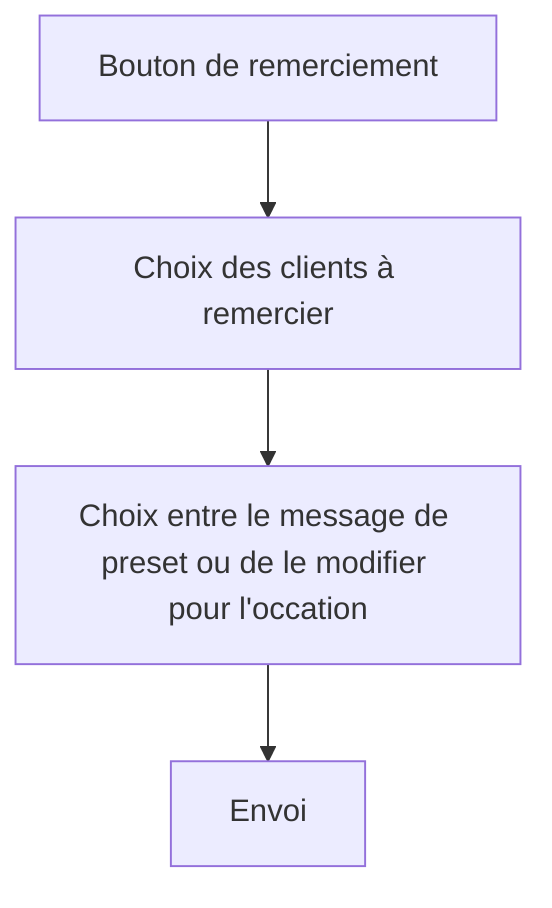
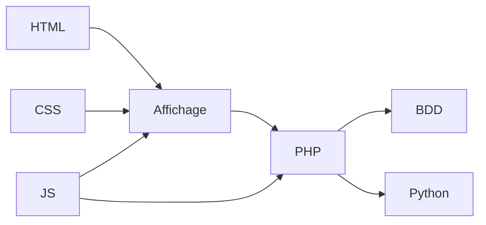

# **Description complète du projet**

## Sommaire


- [Lexique](#lexique)
- [Description générale](#description-générale)
- [Fonctionnalités](#fonctionnalités)
- [Informations supplémentaires](#informations-supplémentaires)
- [Annexe et schéma](#annexe-et-schéma)


## Lexique

- pré-fait : cela veut dire que les champs sont rempli par l'utilisateur au préalable à sa façon avec la possibilité de choisir quoi et ou est disposé des informations en lien avec le client (par exemple dans les mail, l'utilisateur va choisir où le nom de l'entreprise est citée, où son numéro est écrit, etc...)
- Automatiquement rempli : L'ensemble des champs avec des détails variables d'un objet pré-fait sont rempli en fonction du client/contact choisi.
- preset : objet pré-enregistré avec des champs pré-rempli, cela fait référence à pré-fait mais avec une dimension plus grande avec plus de champs.
- Tout ce qui est **<u>en gras souligné</u>** est une chose à préciser avec les discussions client.
- Utilisateur : La personne utilisant le logiciel (l'utilisateur est aussi le client du projet, dans ce document, le client fait référence à autre chose)
- Client : Le client de l'utilisateur

**<u>Partie à valider</u>**


## Description générale

L'outil attendu est un PGI (Progiciel de gestion intégré) combiné avec un CRM - Customer Relationship Management ou Gestion de relation client. Cet outil possède davantage de fonctionnalités que un CRM classique ainsi que des fonctionnalités en moins pour pouvoir se conformer aux besoin d'une micro-entreprise. (1 compte = 1 entreprise, pas de gestion de comptes et d'accès au sein d'une entreprise)

Cet outil doit répondre à plusieurs critères :

- Gestion des produits et services
- Gestion des devis semi-automatisé
- Gestion de la relation client
- Gestion et affichage des résultats et traitements des résultats de l'entreprise
- Gestion des factures
- Gestion des stock


## Fonctionnalités


### **Fonctionnalités générales**

- Un bouton d'appel support dev

  - Il doit permettre d'avoir un retours rapide d'un ou plusieurs dev 

- Un bouton de déconnection

- Un bouton d'aide pour avoir accès à la documentation

- Une barre d'outils pour accéder à l'ensemble des fonctionnalités du logiciel

- Une bulle pour les discussions en cours

- L'ensemble du logiciel doit pouvoir être accessible depuis une page web par ordinateur, téléphone portable ou tablette.

- Le logiciel doit être liable à DropBox afin de générer une base de donnée de secours en cas de problème avec des données régulièrement mis à jours (tous les jours, pas trop souvent non plus afin de ne pas saturer le réseau ect)

- Le logiciel doit pouvoir être liable à d'autres logiciel (à la façon de twitch pouvant être liable à steam ou autre...)

  - **<u>A compléter :</u>** Il faut savoir à quel autre logiciel ou service l'outil doit être liable 

  

**<u>Partie à valider</u>**


### **Fonctionnalités du tableau de bord**

- Disposition du chiffre d'affaire actuel
  - choix de la plage de donnée à afficher
  - Affichage CA hors taxe/ paiement 
  - Affichage de la ligne de croissance
  - Affichage chiffre d'affaire de chaque an
- Affichage des entrées et sorties (Entrée en positif et sortie en négatif)
- Pouvoir voir l'argent que les clients doivent payer et l'argent que l'utilisateur doit aux fournisseur
- Affichage de l'objectif 
- Affichage du ou des solde bancaire
- affichage du montant des devis validé non réalisés
- Affichage des factures en retard de paiement
  - Montant total
  - Affichage des délais de retard (par plage de jours/mois etc)
  - Quand cliqué sur une plage, affichage des différents devis non payés
  - Pouvoir relancer
    - Affichage du courrier avant-envoi
    - Liaison du courier avec les conditions générales de ventes
    - envoi par mail
      - Recevoir une copie du mail
      - Lier la facture
    - Relance par courier 
      - Besoin de crédit pour envoyer par courier
      - Le logiciel fait tout (à voir si il y a un service avec la poste qui existe)
  - Historique des relances


**<u>Partie à valider</u>**


### **Fonctionnalités du système de gestion des dossiers**

- Tableau interactif possédant des dossiers
  - Les colonnes correspondent aux états des dossiers
  - Dans chaque colonnes, un dossier se représente sous forme d'une case cliquable
    - Si on clique cela permet d'ouvrir la description du dossier pour le modifier ou le consulter
  - Chaque dossier peut être glissé d'une colonne à une autre
  - Cela sera dans un style de Github ou Trello
- Un bouton pour relancer les clients n'ayant pas payé ou ne répondant pas à l'envoi d'un devis
- Pouvoir supprimer des dossier (si le dossier est annulé par exemple)
  - Demander une validation afin d'éviter les suppressions involontaires
  - La validation pourrait se faire par la recopie du nom du dossier par exemple
- Pouvoir sélectionner la liste des dossier pour relancer ces dossiers là et non les autres
- Pouvoir automatiquement relancer les clients n'ayant pas payé
- Point important à mettre sur l'ergonomie
- Les Mail automatique :
  - Le mail est pré-enregistré et contient des champs variables et des champs fixes,  lors de l'envoi du mail, les champs variables sont automatiquement rempli en fonction du client et du contact.
  - Le mail doit pouvoir être modifiable si besoin (si il y a des erreurs, des précision ou changement à faire pour des clients spécifique)
- Le client, lorsqu'il reçois le mail, ce dernier possède un lien qui redirige vers le devis, sur cette page il y a :
  - Le lien de la page ne doit pas permettre de retrouver d'autres devis
  - Un bouton pour accepter ou refuser le devis
  - Une zone de tchat pour discuter ou négocier le devis avec l'utilisateur 
- Saisir un acompte pour le paiement avant la réalisation du dossier
- Choisir à qui écrire lors des discussions des devis
- Envoi d'un mail lors de chaque message dors de la discussion (le mail est envoyé au receveur du message)
- Afficher les articles qui n'ont pas étés actualisés depuis un certain temps (délai modifiable dans les paramètres)
- Lier les devis en état de commande aux commandes fournisseurs
  - Logo commande fournisseur pour faire les commandes aux fournisseur
- Dans un dossier, cliquer sur les clients pour voir les infos et retrouver les autres devis, facture ou commandes...
- **<u>A vérifier du comportement voulu lorsque le devis est changé suite à des négociations ou discussions (Si on renvoi un mail ou si c'est juste le document dans le premier mail qui change)</u>**


**<u>Partie à valider</u>**


### **Fonctionnalités sur la création de devis**

- Preset des [informations clients](#informations-d'un-client)
- Modifier les informations clients après le preset 
  Ou ajouter les informations à la main si le client n'existe pas
- Ajouter à la main des lignes ou saut de page pour séparer groupes de produit/service
- Remplissage automatique des informations de l'utilisateur
- Création automatique d'un dossier avec numéro de dossier et état par défaut "brouillon", ou "devis en attente" si le mail à été envoyé
- A la fin de la création du devis, ce dernier est sous forma PDF et est envoyé par mail, téléchargé ou imprimé.
  Il peut être ré-accessible à tout moment dans le dossier.
- [Schéma de création d'un devis](#schéma-de-création-d'un-devis)
- Après la création d'un devis, si le client n'existe pas dans la base de donnée, alors une fenêtre propose de sauvegarder ces informations avec la possibilité de sélectionner quoi enregistrer
  - Les choix seront :
    - Enregistrer le client ou non (ne pas l'enregistrer ferait perdre aussi les informations de contact)
    - Si le client est enregistré alors il peut choisir quel contact enregistrer aussi (il peut en choisir aucun, comme qu'un certain nombre, ou bien tous)
    - Si le client est enregistré mais que les contact  ne le sont pas, cela ne pose pas de soucis, lorsque les informations seront utilisés pour former un nouveau devis, les informations de contact ne seront juste pas présente..
- Proposer la sauvegarde des nouveaux contact.
- Avoir une auto-complétion pour l'écriture des contact d'une entreprise, de base cela n'en écrit aucun lors de l'écriture du preset du client, l'utilisateur va donc noter à quel contact écrire.
- Le prix unitaire des produits d'un devis accepté ne changent pas si les prix fournisseurs changent.
  - C'est-à-dire que, si un devis est créé ,(ou accepté TODO à valider lequel, si le verrouillage se fait lors de la création ou de l'acceptation) l'ensemble des prix des produits ou services sont verrouillés pour ce devis, cela veut dire que si le prix d'un produit ou service change, alors sur le devis, le prix ne changera pas.

**<u>Partie à valider</u>**


### **Fonctionnalités en lien avec les commandes**

- Pouvoir commander des produits d'une commande
  - Soit la totalité
  - Soit uniquement celles sélectionnées
  - Soit uniquement celles manquantes (si gestion des stock)

**<u>Partie à valider</u>**


### **Fonctionnalités sur la gestion des stock**

Cette fonctionnalité n'est pas une fonctionnalité prioritaire !

- Dès qu'un produit est commandé
  - il est ajouté dans les stock
  - il n'est pas considéré comme faisant parti des stock si la commande qui est en lien est encore valide
  - si la commande est annulé et que le produit n'est pas renvoyé alors il passe comme disponible dans le stock
  - TODO info pas claire, à clarifier pour une meilleure conception du système
- Si un devis utilise des produits qui n'ont pas étés commandés alors ça le retire de la liste des stock(ça les comptabilise comme utilisé)
- Mettre un stock minimal qui va mettre une notification visuelle ou par mail (TODO à vérifier) pour indiquer qu'il faut en recommander aux fournisseurs


### **Fonctionnalités sur la gestion des produits** et services

- Chaque produit doit pouvoir être stocké dans une base de donnée avec son [ensemble d'information](#informations-sur-un-produit) 
- Actualisation des prix :
  - Actualisation par le passage au logiciel d'un PDF possédant un tableau avec les produits et leurs prix
  - Proposer à intégrer les articles du PDF qui ne sont pas dans la base de donnée (l'utilisateur peut choisir indépendamment les produit à intégrer)
- Historique des prix 
- Exporter l'ensemble des données des produits et/ou services sous forma Excel 
  - [Pouvoir sélectionner les quels types de données récupérer](#export-des-information-produit/service)
- Barre de recherche : mot clés principales : Nom de produit, catégorie du produit, fournisseur (cela doit prendre en compte les fautes pour proposer des corrections pertinentes pour l'utilisateur)
- Filtres applicables :
  - Catégorie de produit/services
    - Sous-catégorie (dans la catégorie peinture par exemple, la sous catégorie serait de chercher les peintures rouges)
  - Dernière modification du prix
- Voir dans la liste : la dernière date d'actualisation, le prix (en comptant la marge), le début de la description du produit, la référence, le nom.

**<u>Partie à valider</u>**


### **Fonctionnalités sur la gestion des factures**

- [Pouvoir définir un (ou plusieurs) preset de facture pour chaque entreprise](#création-du-preset)
- [Scanner les factures, définir quel preset, et cela ressort les bon résultats](#lecture-d'une-facture)
- Chaque facture scannée est envoyé sous un bon forma au comptable
- Pouvoir prendre une photo de la facture et remplir à la main (TODO actualiser les graphes en lien ci-dessus)

**<u>Partie à valider</u>**


### Fonctionnalités du système de relance

- Il y a dans les paramètres plusieurs choses :
  - Modification du temps de relance automatique 
  - Modification du mail automatique
  - Le nombre de mail avant la dernière relance
  - Le pourcentage d'augmentation des prix du devis

La relance des clients est de deux manières possibles : 

- Relance automatique 
- Relance manuelle individuelle
- Relance manuelle groupée

Dans chaque dossiers, il y a la possibilité de visualiser le nombre de mail de relance.

Surplus de relances

  - Supplément lors de dernière relance (pénalité de retard de paiement)
  - Afficher dans les relances, les retard de paiement


**Relances amicales**

- Envoyer un mail aux clients d'un certain temps pour une vérification du matériel ou autre


**<u>Question : Faut t'il faire des relances automatiques si un dossier n'est pas encore accepté ou les relances sont pour des dossier en attente d'être payé ET des dossiers en attente d'être validé</u>**


#### Relance automatique 

La relance automatique est un mail automatiquement créé qui est envoyé au client avec le devis à l'intérieur. 

Le mail d'envoi est le mail automatique qui est enregistré dans les paramètres

Dans chaque dossier, l'utilisateur à la possibilité de choisir un temps de relance différend de celui indiqué dans les paramètres.


#### Relance manuelle individuelle

La relance manuelle individuelle est un bouton dans le détail d'un dossier. 

La relance manuelle individuelle réinitialise le temps avant la prochaine relance automatique.

- Par exemple si le premier mail de dossier à été envoyé le 1er janvier
- Le timer de base est de 1 mois, cela veut dire que la relance se fera le 1er Février
- Cependant si l'utilisateur fait une relance manuelle, le 15 janvier, le mail de relance suivant sera le 15 Février

Lorsque l'utilisateur fait une relance manuelle individuelle, alors il a deux choix possible :

- Envoyer le mail générique
- Modifier ce dernier pour faire un mail spécifique


#### Relance manuelle groupée

Pour pouvoir relancer un mail groupé, l'utilisateur doit sélectionner plusieurs dossiers (en cochant des cas à côté de chaque dossier par exemple) et clique sur un bouton pour faire la relance.

Le temps de relance est affecté de la même façon que pour la relance manuelle individuelle.

Le mail peut être modifié mais cela doit être fait avec prudence car c'est le même mail qui sera envoyé(en prenant en compte l'encodage du texte)


#### Encodage du mail 


il faudrait que l'utilisateur mette son texte pré-défini et mette des "codes" dans son texte pour les endroits que le logiciel va remplir pour y mettre les informations des clients.

Exemple :
Ce que l'utilisateur marque :

```
Bonjour %nom_entreprise%
Je vous contacte pour vous dire que vous n'avez toujours pas rempli le devis.
Le lien vers le devis est le suivant : %lien_devis%

Le devis est daté du %date_devis%
```

La date du devis serait donc la dernière modification du devis

Ce qui sera envoyé sera donc :

```
Bonjour CRMGenerator3000
Je vous contacte pour vous dire que vous n'avez toujours pas rempli le devis.
Le lien vers le devis est le suivant : Lien

Le devis est daté du 14/10/2020
```


### **Fonctionnalités autre**

- [Pouvoir générer des mail automatique ou générique à tout les anciens client pour les remercier](#envoi-de-mail-de-remerciement) (en évitant de le renvoyer à ceux l'ayant déjà reçus)

- Pouvoir générer des lettres/colis automatiquement en y mettant des goodies pour les envoyer aux anciens clients (en évitant les doublons)
  - **<u>A vérifier du comportement voulu précisément : Cela fait juste le texte des lettres et colis ou cela fait tout en faisant appel à un service externe</u>**
  
- Lier le compte bancaire de l'entreprise pour : 
  - Extraire les informations des entrées et sorties pour afficher le chiffre d'affaire
  - Faire un suivis des entrées et sorties de l'entreprise
  - Passer les commandes des produits
  
- Il faut pouvoir générer des factures de déplacement ces derniers sont :
  - Aux frais de l'entreprise
  - Aux frais du client
  
- Le logiciel doit pouvoir récupérer les informations des produits à partir de l'ancien logiciel utilisé afin d'améliorer le passage de l'un à l'autre

- le logiciel doit pouvoir envoyer des mail 
  - de façon générale, l'ensemble des mails envoyé par le logiciel passeront par cette fonctionnalité
  - Le logiciel doit  pouvoir aussi prendre un nom de domaine spécifique ou général (à voire)
  
- Pouvoir se connecter et/ou se déconnecter. (connection avec email et mdp)

- Gestion des licences

  - Gestion des licences d'abonnement
    - Licence gratuite de test (permanent)
    - Licence gratuite d'essai (6 mois par exemple)
    - Licence payante par mois 
    - Licence payante par trimestre
    - Licence payante par an
    - Licence payante à vie

  - Gestion des réductions

  - Comparaison à des concurrent
    - Evoliz = 400 € /an

  


**<u>Partie à valider</u>**


## Informations supplémentaires


### **Informations d'un dossier**

- Numéro de dossier
- Titre de dossier (Titre du devis)
- Informations du client
- Devis en lien avec le dossier
- Le nombre de relance effectuée
- Le mail de preset (par défaut le mail est copié par celui dans les paramètres)
- Le temps de relance
- Le mail de preset de la dernière relance
- La date de la précédente relance (le premier mail envoyé lors de la création du dossier est considéré comme une relance)
- L'état du dossier 

  - Brouillon
  - devis en attente
  - devis accepté
  - commande en cours de réalisation
  - commande réalisée
  - Commande payée
  - Commande non payée (Le dossier passe dans cette case si la dernière relance est envoyée)
  - Commande annulée
  - D'autres états peuvent être ajoutés, ce ne sont que des exemples.
    Un dossier n'a qu'un état à la fois, et n'est pas sensé revenir en arrière.
    **<u>Voir si la liste des état est bonne : Pas voir un service de maintenance avec état de maintenance</u>**
- L'historique des états avec les dates
- Liste d'étiquettes

  - Ces étiquettes peuvent être pour détailler l'état du dossier ou donner des précisions.
    Une étiquette peut être par exemple "Payé" si une commande est payée mais qu'elle n'est pas encore fini d'être réalisée..
    L'accompte TODO 

**<u>Partie à valider</u>**


### **Informations d'un client**

Ces informations sont utilisés pour remplir automatiquement avec les preset

- Nom de l'entreprise
- Adresse du siège de l'entreprise
- Informations de contacts (pour chaque contact)
  - Nom et prénom du contact
  - e-mail de contact( ou adresse)
  - Numéro de téléphone 
- Adresse de facturation
- Pays du client
- Taxes en lien avec le pays en question
- La liste des dossiers en lien avec le client (passés, en cours, à venir)
- Combien un client à rapporté (chiffre d'affaire et bénéfices)

**<u>Partie à valider</u>**


### Informations utilisateur

Ces informations sont utilisés pour être disposés dans les devis ou lettres, elles sont modifiables au cas par cas si certains devis ou lettres en ont besoin et sont modifiable pour le global dans les paramètres. Elles sont utiles si le client à besoin de recontacter l'utilisateur et sont impérative dans le cas d'un devis.
Les informations sont les suivantes :

- Nom de l'entreprise
- Informations de contact
  - Adresse de contact
  - Email
  - Nom 
  - Prénom
  - Numéro Télephone


### **Informations d'une ligne d'un devis**

#### Les différents types de lignes

​	**Ligne simple** 
Une ligne simple représente un produit ou un service, si l'utilisateur rempli le nom du produit ou sa référence, le logiciel doit pouvoir remplir automatiquement les informations qui sont en lien.

Si le produit n'appartient pas à la base de donnée alors il peut remplir les informations à la main.

​	**Saut de page**
Permet de mettre les lignes suivantes sur une page supplémentaire

​	**Groupe de ligne**
Preset de lignes simple, saut de page ou groupe de ligne permettant d'ajouter rapidement des groupes de produit/service pouvant être régulièrement utilisés

Les groupes de lignes sont éditables dans les settings


#### Informations pour un produit

- Référence du produit (référence que l'utilisateur à donné et non la référence fournisseur)
- Description du produit/service ainsi qu'une description pour sa pause ou la méthode utilisé
- Prix unitaire fournisseur
- Nombre de produit/service
- Marge individuelle par produit
  - **<u>Question sur les marges : si on met une marge sur l'ensemble du devis, cela retire les marges individuelles ou pas ?</u>**
- Réduction individuelle par produit 
  - possible d'ajouter une réduction supplémentaire pour l'ensemble du devis dans la fin du processus de création du devis
- Prix TTC **<u>Question : Seul le prix TTC est affiché sur le PDF ?</u>**

**<u>Partie à valider</u>**


### **Informations sur un produit**

Un produit est stocké avec ces informations :

- Référence fournisseur
- Référence utilisateur
- Nom fournisseur
- Lien du fournisseur/base de donnée ou autre pour retrouver le prix du produit
- Nom du produit
- Description du produit et/ou de son utilisation
- Texte pré-défini qui sera écrit dans un devis (pouvant être modifié manuellement sur le devis sans changer le texte enregistré)
- Prix fournisseur
- Marge de base
- Prix HT après marge (la taxe n'est calculé que lors du devis en fonction de la taxe à appliquer) ce prix n'est pas directement stocké, pour des raisons de place et de facilité, ce prix est juste calculé et affiché lorsque c'est nécessaire
- Historique des prix


Les références fournisseur ne doivent pas être visible par les clients  de l'utilisateur afin que ce dernier ne puisse pas faire jouer la  concurrence ou calculer la marge faite sur le produit. C'est pour cela  qu'il y a une référence fournisseur et une référence utilisateur.
 L'utilisateur va montrer ses références à lui, mais dans la base de donnée il faut que les deux références soient présentes.


**<u>Partie à valider</u>**


### **Informations sur les services** 

- Nom du service 
- Référence utilisateur
- Description
- Prix minimal en dessous duquel le service n'est pas  rentable
- Marge
- Prix HT après marge (la taxe n'est calculé que lors du devis en fonction de la taxe à appliquer)


**<u>Partie à valider</u>**

### Informations dans les paramètres 

- la gestion des lignes de groupes
  - Pouvoir utiliser des lignes simples, des saut de page ainsi que des lignes de groupes pré-existante
  - Deux lignes de groupes ne doivent pas s'appeler l'une à l'autre, un message d'erreur est affiché si c'est le cas lors de enregistrement de la ligne de groupe
- Gestion de relance
  - Le temps par défaut avant un mail de relance
    - Temps en jours ou mois
    - 0 si il n'y a pas de relance
  - Le preset de mail
  - Ces deux choses ci dessus peuvent être édités dans le dossier si des adaptations indivduelles doivent pouvoir être faites
  - Le nombre de relance avant la dernière
  - Le preset de mail de dernière relance
- Pouvoir choisir le mode sombre ou pas
- Changer le nom de compte et de mot de passe
- Changer/mettre le code de la base de donnée
- 


## Annexe et schéma


### **Création de devis**

#### Schéma de création d'un devis

**<u>Partie à valider</u>**



 


#### Schéma d'ajout de ligne

**<u>Partie à valider</u>**




### **Gestion de facture**

#### Création du preset 





#### Définition des zones





#### Lecture d'une facture




### Etat d'un dossier



### Export des informations produit/service





### Envoi de mail de remerciement
TODO bouton courrier pour tout avoir
(avoir plusieurs preset de courrier : remerciement, )




### Architecture appli




# Brouillon


### Question

- Est ce que un produit à plusieurs prix fournisseur en fonction de la quantité achetée
- Besoin d'informations sur les dates de validités d'un devis
- Mettre une date d'invalidité et de suppression d'un devis
- Informations de la suite de ce qu'il se passe après l'inscription des factures
- Besoin de relancer les dossiers en attente ? pour relancer et faire accepter le devis ?


### Visuel rappel (nicolas)

- Produit
  - Filtrer par fournisseur
  - Barre de recherche
- Page d'accueil
  - Afficher le nombre de devis qui vont devenir invalide
  - Afficher le nombre de factures qui vont arriver à bout de temps


### à faire : 

- Avoir un mail pour pouvoir avoir accès à une version 7 jours gratuit afin d'avoir des infos sur ce dont on a besoin.
- Avoir un nom d'entreprise
- Avoir un logo
- Vérifier l'ensemble des choses à mettre dans les paramètres, voire aussi pour chaque section de fonctionnalité quelles choses ajouter dans les paramètres
- Mettre au propre l'ensemble du dossier


